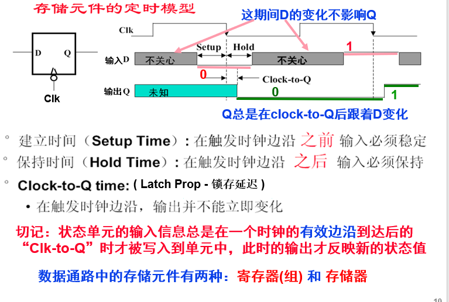
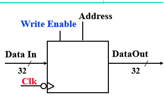
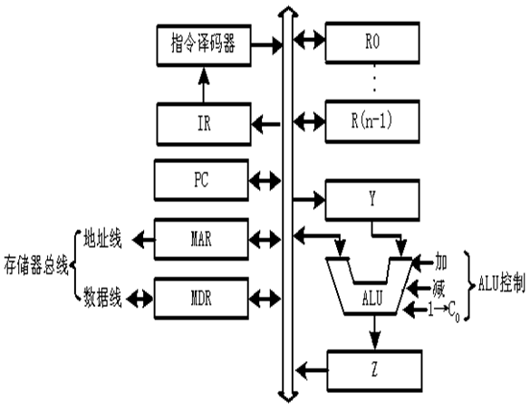

## 中央处理器
#### CPU执行指令过程

* 取指令
* PC + "1"送PC
* 指令译码
* 进行主存地址运算
* 取操作数
* 进行算术/逻辑运算
* 存结果

以上每步都需检测“异常”，若有则自动切换到异常处理程序
检测是否有“中断”请求，有则转中断处理

#### 计算机性能(程序执行时间)由三个关键因素决定：指令数目、CPI、时钟周期
* 指令数目由编译器和ISA决定
* 时钟周期和CPI由CPU的实现以及其他因素来决定

#### 每条指令的功能总是由以下四种基本操作来实现：
* 读取某一主存单元的内容，并将其装入某个寄存器（取指， 取数）
* 把一个数据从某个寄存器存入给定的主存单元中（存结果）
* 把一个数据从某个寄存器送到另一个寄存器或者ALU（取数，存结果）
* 进行算术或逻辑运算（PC+1，计算地址，运算）


CPU 由 执行部件和控制部件组成，或者说：CPU 包含数据通路(执行部件)和控制器（控制部件）

控制器主要由指令译码器和控制信号形成部件组成


#### _数据通路是什么:_
```
指令执行过程中，数据所经过的路径，以及路径中的部件。它是指令的执行部件。
```
#### _控制器（Control）的功能:_
```
对指令进行译码，生成指令对应的控制信号，控制数据通路的动作。能对执行部件发出控制信号，是指令的控制部件。
```

#### 数据通路完整定义
```
由操作元件和存储元件通过总线方式或分散方式连接而成的进行数据传送、处理和存储的路径。 
```
#### 数据通路由两类元件组成
* 组合逻辑元件（也称操作元件）
* 时序逻辑元件（也称状态元件，或存储元件）

#### 元件间的连接方式有两种方式
* 总线连接方式
* 分散连接方式

#### 数据通路如何构成？
* 由“操作元件”和“存储元件”通过总线方式或分散方式连接而成

#### 数据通路的功能是什么？
* 进行数据传送、处理和存储

#### 组合逻辑元件的特点：
* _其输出只取决于当前的输入_。即：若输入一样，则其输出也一样
* _无定时_: 所有输入到达后，经过一定的逻辑门延时，输出端改变，并保持到下次改变，不需要时钟信号来定时

#### 常见到操作元件（组合逻辑元件）有：
* 加法器(Adder)
* 多路选择器(MUX)
* 算逻部件(ALU)
* 译码器(Decoder)

#### 状态元件（存储元件）的特点：

* 具有存储功能，在时钟控制下输入被写到电路中，直到下个时钟到达
* 输入端状态由时钟决定何时被写入，输出端状态随时可以读出



#### 理想存储器
* ```Data Out```：32位读出数据
* ```Data In```： 32位写入数据
* ```Address```：读写共用一个32位地址
* ```读操作```（组合逻辑操作）：
 地址Address有效后，经一个“取数时间AccessTime”，Data Out上数据有效。
* ```写操作```（时序逻辑操作） ：
写使能为1的情况下，时钟Clk有效边沿到来时，Data In传来的值开始被写入Address指定的存储单元中。



#### 单总线数据通路



#### ISA确定后，进行处理器设计的大致步骤如下：
* 第一步：分析每条指令的功能，并用RTL(Register Transfer Language)  
              来表示。
* 第二步：根据指令的功能给出所需的元件，并考虑如何将他们互连。
* 第三步：确定每个元件所需控制信号的取值。
* 第四步：汇总所有指令所涉及到的控制信号，生成一张反映指令与控制信    	  号之间关系的表。
* 第五步：根据表得到每个控制信号的逻辑表达式，据此设计控制器电路。

#### 数据通路中的关键路径(Load操作)花费的时间：
* 关键路径时长 = PC的 Clk-to-Q时间 + 指令存储器的取数时间 + 寄存器组的取数时间+ ALU 加法延时 + 数据存储器的取数时间 + 写寄存器的建立时间 + 时钟偏移

#### MIPS指令格式中指示操作性质的字段有两个：```op``` 和 ```func```
* ```func```只用于R型指令，形成对应的ALU的功能控制信号。
* ```op```用来产生各种控制信号，包括了非R型指令的ALU功能控制信号。

### 控制器设计小结
 1. 控制器设计的关键是找出指令格式中规定指令功能（类型）的字段与各条指令所需要的控制信号之间的关系。
   * MIPS指令中有op和func两个字段用来表示指令的功能。
   * (1)R型指令：所有指令的op字段都为000000，各指令的func字段用来产生ALU的控制信号，决定执行的操作（加、减、逻辑与…），其它数据通路的控制信号各指令都相同（仅考虑三寄存器操作数）。
   * (2)其他类型指令：没有func字段，各指令的op字段不同，它产生包括ALU的所有数据通路的控制信号。
2. 控制器结构分成主控制器和ALU局部控制器两部分。
 * (1)ALU局部控制器是为R型指令产生ALU的控制信号，其输入为func字段；
  * (2)主控制器产生非R型指令的所有控制信号，以及R型指令的除ALU控制信号外的其他控制信号，其输入为op字段；
  * (3)将主控制器产生的ALU控制信号与ALU局部控制器的输出信号通过一个多路选择器合并后作为最终的ALU控制信号。多路选择器的选择信号(R-Type)由主控制器产生。

  #### lw指令的执行时间最长, 它所花时间作为时钟周期

#### 程序执行被 “中断” 的事件有两类
* 内部“异常”：在CPU内部发生的意外事件或特殊事件

    按发生原因分为硬故障异常和程序性异常两类
    * 硬故障异常：如电源掉电、硬件线路故障等
    * 程序性异常：执行某条指令时发生的“例外(Exception)”，如溢出、缺页、越界、越权、非法指令、除数为0、堆栈溢出、访问超时、断点设置、单步、系统调用等。
* 外部“中断”：在CPU外部发生的特殊事件，通过向CPU发“中断请求”信号，请求CPU处理。
    * 如实时时钟、控制台、打印机缺纸、外设准备好、采样计时到、DMA传输结束等。

#### 外部中断是一种I/O方式

#### 内部“异常” 按处理方式又分为故障、自陷和终止三类
* 故障(fault) ：执行指令引起的异常事件，如溢出、缺页、堆栈溢出、访问超时等。“断点”为发生故障指令的地址

* 自陷(Trap) ：预先安排的事件，如单步跟踪、系统调用(执行访管指令)等。是一种自愿中断。
* 终止(Abort) ：硬故障事件，此时机器将“终止”，调出中断服务程序来重启操作系统。“断点”是什么？ 随便！

缺页、TLB缺失等：补救后可继续，回到发生故障的指令重新执行；  

溢出、除数为0、非法操作、内存保护错等：终止当前进程。

### 处理器中的异常处理机制
#### 检测到异常时，处理器必须进行以下基本处理：
* ① 关中断（“中断/异常允许”状态位清0）：使处理器处于“禁止中断”状态，以防止新异常(或中断)破坏断点、程序状态和现场（现场指通用寄存器的值）。
* ② 保护断点和程序状态：将断点和程序状态保存到堆栈或特殊寄存器中。即：
     * PC→堆栈 或 EPC（专门存放断点的寄存器）
     * PSWR →堆栈 或 EPSWR （专门保存程序状态的寄存器）
```
    PSW（Program Status Word）：程序状态字，包括条件码、中断码、状态位等。   

    PSWR（PSW寄存器）：用于存放程序状态字的寄存器。如，X86的FLAGS）。
```
* ③ 识别异常事件：有软件识别和硬件识别（向量中断方式）两种不同的方式。

#### 异常识别的两种方式：软件识别和硬件识别（向量中断方式）。

#### 在数据通路中加入异常处理必须考虑：
* 保存断点和异常原因，并将控制转到异常处理程序首地址处


